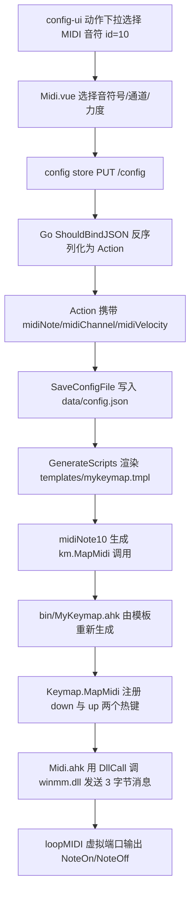

# MIDI 音符动作 — 开发者文档

面向维护与二次开发，说明「MIDI 音符」动作的端到端实现、数据模型、关键机制与扩展方向。用户使用说明见 [`doc/midi.md`](doc/midi.md:1)。

## 1. 架构总览

一句话数据流：前端配置动作 → Go 后端持久化并渲染脚本 → AHK 运行时注册热键 → winmm.dll 向虚拟端口发送 NoteOn/NoteOff。



## 2. 三端改动清单

### 2.1 前端 config-ui

| 文件 | 职责 |
|---|---|
| [`config-ui/src/components/actions/Midi.vue`](config-ui/src/components/actions/Midi.vue:1) | 动作编辑组件：音符号下拉（128 项）、通道下拉（1–16）、力度滑块（1–127） |
| [`config-ui/src/components/actions/Action.vue`](config-ui/src/components/actions/Action.vue:31) | 注册动作类型 `{ id: 10, label: "label:210", hideInAbbr: true }` 与组件映射 `10: Midi` |
| [`config-ui/src/types/config.ts`](config-ui/src/types/config.ts:21) | `Action` 增 `midiNote?/midiChannel?/midiVelocity?`；新增 `Midi` / `MidiPorts` 接口 |
| [`config-ui/src/store/language-map.ts`](config-ui/src/store/language-map.ts:112) | 标签 210（动作名）与 411–417（字段/端口提示与 loopMIDI 前提说明） |
| [`config-ui/src/views/Settings.vue`](config-ui/src/views/Settings.vue:396) | MIDI 设置分区：端口 combobox，取不到端口时降级为文本框 |
| [`config-ui/src/store/server.ts`](config-ui/src/store/server.ts:15) | `getMidiPorts()` 请求 `GET /midi-ports` |

### 2.2 后端 config-server（Go）

| 文件 | 职责 |
|---|---|
| [`config-server/internal/script/config.go`](config-server/internal/script/config.go:50) | `Action` 增 `MidiNote/MidiChannel/MidiVelocity` 字段，否则反序列化时被丢弃 |
| [`config-server/internal/script/options.go`](config-server/internal/script/options.go:20) | `Options` 增 `Midi` 字段与 `Midi{ portName }` 结构体 |
| [`config-server/internal/script/action.go`](config-server/internal/script/action.go:185) | `midiNote10` 生成器 |
| [`config-server/templates/mykeymap.tmpl`](config-server/templates/mykeymap.tmpl:11) | `#Include lib/Midi.ahk`；[`InitKeymap`](config-server/templates/mykeymap.tmpl:31) 内判断 `MidiInit("端口名")` 返回值，失败时调用 `MidiShowNotReadyTip()` |
| [`config-server/internal/midi/midi_windows.go`](config-server/internal/midi/midi_windows.go:1) | 标准库 syscall 枚举 MIDI 输出端口 |
| [`config-server/cmd/settings/main.go`](config-server/cmd/settings/main.go:161) | `GetMidiPortsHandler` 与路由 `GET /midi-ports` |

### 2.3 AHK 运行时 bin/lib

| 文件 | 职责 |
|---|---|
| [`bin/lib/Midi.ahk`](bin/lib/Midi.ahk:1) | winmm.dll 封装：`MidiInit / MidiShowNotReadyTip / MidiNoteOn / MidiNoteOff / MidiAllNotesOff / MidiClose / MidiDebugPorts` |
| [`bin/lib/KeymapManager.ahk`](bin/lib/KeymapManager.ahk:484) | `Keymap.MapMidi` 注册 down/up 两个热键 |
| [`bin/lib/Functions.ahk`](bin/lib/Functions.ahk:27) | `MyKeymapExit` 退出时发送 All Notes Off 并关闭端口 |

> `bin/MyKeymap.ahk` 是模板生成物，不要直接修改；改动应落在模板与 Go 生成器上。

## 3. 数据模型

### 3.1 动作级字段

| 字段 | 类型 | 说明 | 缺省 |
|---|---|---|---|
| `midiNote` | int | 音符号 0–127（C-1=0 … G9=127） | 未设置 |
| `midiChannel` | int | MIDI 通道 1–16 | 1 |
| `midiVelocity` | int | 力度 1–127 | 100 |

- Go 侧使用 `omitempty`，TS 侧为可选属性，0 值即「未设置」。
- 前端在首次选择音符号时补齐通道/力度默认值，避免后端收到 0。
- 切换动作类型时 [`onActionTypeChange`](config-ui/src/components/actions/Action.vue:53) 会清理这些字段。

### 3.2 全局设置

```go
type Midi struct {
    PortName string `json:"portName"` // 例如 "loopMIDI Port"
}
```

`Options.Midi` 参与 `PUT /config` 的读写。**`PortName` 为空字符串时，[`ParseConfig`](config-server/internal/script/config.go:57) 会将其缺省为 `loopMIDI Port`**（与 [`Mouse.TipSymbol`](config-server/internal/script/config.go:70)、`CommandInputSkin` 的缺省处理写在一起），因此模板渲染出的 `MidiInit(...)` 始终会收到一个非空端口名。AHK 侧对该端口名做**精确匹配**；匹配不到即返回 `false`，**不自动创建、不回退**，由模板调用 `MidiShowNotReadyTip()` 提示用户去 loopMIDI 创建该端口。

## 4. 关键机制

### 4.1 MapMidi 的 down/up 成对注册

[`MapMidi`](bin/lib/KeymapManager.ahk:484) 对标 [`RemapInHotIf`](bin/lib/KeymapManager.ahk:457) 的写法，注册两个热键：

```ahk
MapMidi(hotkeyName, note, channel := 1, velocity := 100, keymapToLock := false, winTitle := "", conditionType := 0) {
  if InStr(hotkeyName, "singlePress") {
    return ; singlePress 无物理松开语义, 会卡音, 直接跳过
  }
  downHandler(thisHotkey) => MidiNoteOn(note, channel, velocity)
  upHandler(thisHotkey)   => MidiNoteOff(note, channel)
  this.Map(hotkeyName, downHandler, keymapToLock, winTitle, conditionType)
  this.Map(hotkeyName . " up", upHandler, false, winTitle, conditionType)
}
```

- 第 5 个参数刻意命名为 `keymapToLock`，使 Go 侧 `GetHotkeyContext` 生成的 `, , winTitle, conditionType` 空占位能自然对齐。
- `keymapToLock` 只在按下时生效，松开不重复锁定。

### 4.2 midiNote10 生成规则

[`midiNote10`](config-server/internal/script/action.go:185) 复用 `Cfg.GetHotkeyContext(a)` 拼出窗口条件，并对 0 值兜底：

```go
func midiNote10(a Action, inAbbrContext bool) string {
    if inAbbrContext { return "" } // 前端已 hideInAbbr
    channel := a.MidiChannel;  if channel == 0 { channel = 1 }
    velocity := a.MidiVelocity; if velocity == 0 { velocity = 100 }
    return fmt.Sprintf(`km.MapMidi("%[1]s", %[2]d, %[3]d, %[4]d%[5]s)`,
        a.Hotkey, a.MidiNote, channel, velocity, Cfg.GetHotkeyContext(a))
}
```

生成示例：`km.MapMidi("*q", 60, 1, 100)` 或带窗口组 `km.MapMidi("*q", 60, 1, 100, , "ahk_exe code.exe", 1)`。

### 4.3 winmm 消息字节构成

[Midi.ahk](bin/lib/Midi.ahk:122) 把短消息打包为 32 位 `dwMsg`，低字节为状态字节：

| 消息 | 状态字节 | 定义 |
|---|---|---|
| NoteOn | `0x90 \| (channel-1)` | `dwMsg = 0x9n \| (note<<8) \| (velocity<<16)` |
| NoteOff | `0x80 \| (channel-1)` | `dwMsg = 0x8n \| (note<<8)` |
| All Notes Off | `0xB0 \| (channel-1)` | `dwMsg = 0xBn \| (123<<8)` |

对外通道为 1–16，内部统一以 `(channel - 1) & 0x0F` 换算为 winmm 的 0–15。

### 4.4 端口枚举与匹配

- AHK 侧 [`MidiInit`](bin/lib/Midi.ahk:60)：`midiOutGetNumDevs` 取数量，逐个 `midiOutGetDevCapsW` 读 `MIDIOUTCAPS`；`szPname` 在偏移 8。**仅精确匹配端口名（忽略大小写）**：匹配到则用 winmm `midiOutOpen` 打开并用 `midiOutShortMsg` 发送；匹配不到或 `midiOutOpen` 失败一律返回 `false`，把原因写入 `g_MidiLastError`，并记录请求名 `g_MidiRequestedPortName` 供提示使用。句柄缓存在模块级静态变量中，进程内只打开一次。
- **不再自动创建端口**：曾用 teVirtualMIDI `virtualMIDICreatePortEx2` 在本进程内自建端口，但该端口**不通过 winmm 向系统注册**，系统枚举（`midiOutGetNumDevs`）看不到它，DAW / MIDI 监视器等外部程序无法枚举与打开，数据只能自己发给自己。故本方案放弃自动创建，改为要求用户在 loopMIDI 中创建持久端口。
- **不再回退**：不再回退到「名字含 `loopMIDI` 的端口」或 0 号设备，避免端口名写错时意外从其它端口发声。
- **用户提示**：端口不可用时，模板调用 [`MidiShowNotReadyTip()`](bin/lib/Midi.ahk:155)，用项目既有 `Tip()` 弹出一次提示，告知去 loopMIDI 创建端口（`Tip` 用 `try` 包裹，未加载或异常时不影响启动）。
- Go 侧 [`OutputPortNames`](config-server/internal/midi/midi_windows.go:31) 同样枚举端口名，供 `GET /midi-ports` 返回给设置页下拉。

### 4.5 退出防卡音

[`MyKeymapExit`](bin/lib/Functions.ahk:27) 在退出时：

```ahk
try MidiAllNotesOff() ; 对 16 个通道发送 CC123
try MidiClose()       ; 关闭 midiOut 句柄
ExitApp
```

用 `try` 做存在性保护，避免精简构建未加载 Midi.ahk 时中断退出。

## 5. 扩展方向建议

- **NoteOff 延迟 / 音长控制**：在 `upHandler` 中用 `SetTimer` 延迟发送 NoteOff，实现固定音长；需注意同音重复触发时的定时器覆盖。
- **力度曲线 / 多档力度**：把 `velocity` 由标量扩展为「力度 + 曲线」，或按修饰键切换力度的映射表。
- **同时多音 / 和弦**：一个热键同时 NoteOn 多个音符号，需在 up 时对称 NoteOff 全部音。
- **MIDI 输入映射到键盘**：反过来用 `midiInOpen` + 回调把外部 MIDI 设备输入映射为按键/动作，需处理回调线程与 AHK 消息循环。
- **CC 控制**：把动作泛化为「发送任意 MIDI 短消息」，可覆盖控制变更、音色切换、Pitch Bend 等。
- **端口热切换**：目前端口在 `MidiInit` 时确定，若要运行时切换需先 `MidiClose` 再重开。
- **`Options.Midi` 开关**：设计稿曾包含 `Enabled` 字段，当前实现未落地；如需可加入并在模板条件渲染 `MidiInit`。

## 6. 已知限制与技术债

- 仅支持键盘键：鼠标滚轮无 `up` 事件，MIDI 不适用。
- 缩写模式下不适用（前端 `hideInAbbr`，后端 `inAbbrContext` 返回空）。
- `singlePress` 无物理松开语义，`MapMidi` 直接跳过注册。
- **依赖外部 loopMIDI**：端口必须由 loopMIDI 创建并保持运行，MyKeymap 不再自动创建；未创建时 MIDI 动作不生效（启动时仅提示一次）。
- 端口名写错不会回退，只会提示不可用，因此不会误从其它端口发声。
- `Options.Midi.Enabled` 开关未实现，当前仅靠 `PortName` 与端口存在性决定行为。
- 端口在进程生命周期内只打开一次，缺少运行期重连/热插拔处理（loopMIDI 中途退出不会自动重连）。
