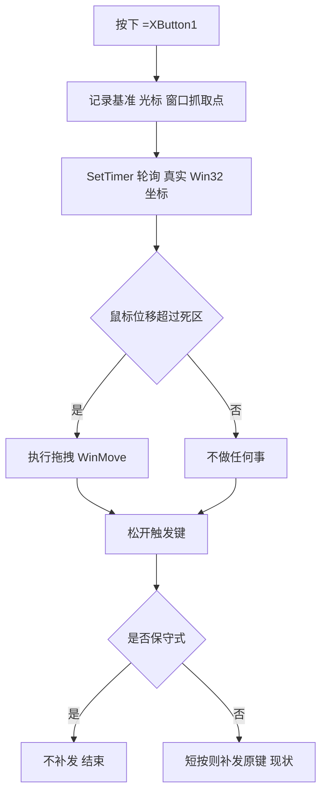

# 保守式拦截（防漏键）映射设计

## 1. 需求

为按键映射增加一个**可选标识符**（用户提议 `=` 前缀，如 `=XButton1`），语义为**保守式监控 / 完全拦截**：

- 按下该键 → 若鼠标移动了，执行拖拽（或映射的动作）；
- 若鼠标**没有移动**，**也不放行原键**（视作没有按过这个键），不会触发「后退/前进」等原生功能；
- 目标：**永不漏键**（原键功能绝不被放行）。
- 期望能作用于**全部映射**，而不是只针对拖拽功能。

## 2. 现状：按键「被放行」的全部路径（漏键来源）

当前 MyKeymap 的按键**默认由 AHK 热键钩子拦截**（模板 [`mykeymap.tmpl`](../config-server/templates/mykeymap.tmpl:3) 第 3 行 `#UseHook true`，鼠标键走鼠标钩子）。但代码中**多处会主动把原键「发回」**，这才是「放行/漏键」的来源：

| # | 位置 | 行为 | 触发条件 |
|---|---|---|---|
| 1 | [`StopDragWindowNoCursor()`](../bin/lib/Actions.ahk:202) 第 217 行 | `Send("{blind}{key}")` 补发原键 | **短按未拖动**（<250ms 且未超死区） |
| 2 | [`_handleDelay()`](../bin/lib/KeymapManager.ahk:32) 第 46 行 | `Send("{blind}{WaitKey}{EndKey}")` | 引导键按下后 delay 内又按了别的键 |
| 3 | [`Keymap.Wait()`](../bin/lib/KeymapManager.ahk:299) 第 330-332 行 | `Send("{blind}{WaitKey} Down/Up")` | 鼠标按钮作触发键且发生拖动（手势兼容） |
| 4 | 窗口组条件不满足 | 热键被 `Disable()`，物理键直接穿透 | 配置了 `windowGroupID` 且条件不匹配（**设计如此**） |
| 5 | 高频场景 | 热键子程序仍在运行 / `A_HotkeyInterval` 节流 | 需实测确认 |

> **关键结论（针对你的现象）**：你遇到的「高频时放行」，最可能来自 **路径 1**——我为拖拽功能加的「短按补发原键」逻辑。它把 XButton1 发回，于是浏览器执行了「后退」，看起来就是「漏键/放行」。
> 而这次要加的 `=` 语义，本质就是**关闭该补发**，并保证完全拦截。

## 3. 设计方案

### 3.1 标识符与语义

在热键字符串前加 `=`（与 AHK 现有前缀 `*$~` 并列，`=` 在 AHK 中无特殊含义，安全作扩展标记）：

| 写法 | 语义 |
|---|---|
| `XButton1` / `*XButton1` | 现状：默认拦截，但**短按/特定路径会补发原键** |
| `=XButton1` | **保守式**：全程拦截，**任何情况下都不补发原键**；未拖动 = 什么都没发生 |

### 3.2 处理流程



### 3.3 复杂度评估（回答你的问题）

**很低。可以作用于全部映射。** 理由：

- 「拦截」本身 AHK 已默认完成（无需额外机制）；
- 需要的只是**一个布尔标记**贯穿三处：
  1. **Go 生成**（[`action.go`](../config-server/internal/script/action.go:26) 的 `actionToHotkey`）：识别 `=` 前缀，生成时把该键的 `Map` 调用加一个「保守」参数，并从热键串中剥离 `=`（否则 AHK 无法注册）；
  2. **AHK 注册**（[`Keymap.Map()`](../bin/lib/KeymapManager.ahk:253) 的 `_Hotkey` 构造）：记录 `conservative` 标志，存进 keymap 项；
  3. **行为点**：保守键在 [`StopDragWindowNoCursor()`](../bin/lib/Actions.ahk:202) 直接跳过补发；其余补发路径（`_handleDelay`/`Wait`）也按该标志跳过。

- 由于标识符是**加在热键串上**的，它对**任何动作类型**都生效（不限于拖拽），天然满足「给全部映射」。
- 前端只需在「触发键」输入处允许输入 `=` 前缀（或加一个勾选框「完全拦截（不漏键）」），翻译标签若干。

### 3.4 接入点清单

| 层 | 文件 | 改动 |
|---|---|---|
| 后端 | [`config-server/internal/script/action.go`](../config-server/internal/script/action.go:26) | `actionToHotkey` 解析 `=` 前缀 → 剥离 + 传 conservative 标志 |
| 后端 | [`config-server/internal/script/action.go`](../config-server/internal/script/action.go:228) | ValueID 17/18 生成时把 conservative 传给 AHK（如 `StartDragMoveWindowNoCursor(true)`） |
| AHK | [`bin/lib/KeymapManager.ahk`](../bin/lib/KeymapManager.ahk:253) | `Map()` / `_Hotkey` 支持 conservative 选项 |
| AHK | [`bin/lib/Actions.ahk`](../bin/lib/Actions.ahk:202) | `StopDragWindowNoCursor` 依据 conservative 决定是否补发 |
| 前端 | [`config-ui/src/components/actions/`](../config-ui/src/components/actions) | 触发键输入支持 `=` 前缀 / 或加勾选框 |
| 翻译 | [`config-ui/src/store/language-map.ts`](../config-ui/src/store/language-map.ts:1) | 新增说明标签 |

## 4. 最终实现记录

> 本节记录已落地的实现（分支 `feat/window-drag-resize`），取代原「待确认决策点」。

### 4.1 标识符与语义（已定）

| 写法 | 语义 |
|---|---|
| `XButton1` / `*XButton1` / `^!\`` | 现状不变：默认拦截，可被 `_handleDelay` / `Wait` 的兼容路径补发原键 |
| `=XButton1` / `=*XButton1` / `=^!c` | **保守式**：任何情况下都不放行原键（未拖动/长按/短按都不补发） |
| 内置「拖拽移动(17) / 拖拽缩放(18)」 | **默认即保守式**，无需书写 `=`（已移除短按补发逻辑） |

### 4.2 AHK 侧实现

**A. `=` 解析与登记 —— [`Keymap.Map()`](../bin/lib/KeymapManager.ahk:253)**
- 用「原热键串是否含 `=`」判定 `conservative`（支持 `=` 在任何前缀前后，如 `=XButton1`、`=*XButton1`、`=^!c`）；
- 关键：`rawName := StrReplace(hotkeyName, "=")` **剥离所有 `=`** 后才交给 [`Keymap._Hotkey`](../bin/lib/KeymapManager.ahk:208) → `Hotkey(rawName, ...)`，因为 AHK 热键前缀集合为 `~*$#!^+<>`，不认识 `=`，不剥离会注册失败；
- conservative 键按 `ExtractWaitKey(rawName)` 登记到 `KeymapManager.Conservative`（Map 集合），并给 `_Hotkey` 实例加 `conservative` 字段；
- 未带 `=` 的写法走原逻辑，行为完全不变。

**B. `ExtractWaitKey` 兼容 —— 第 666 行**
- Trim 集合加入 `=`（`" #!^+<>*~$="`）；`&` 组合键分支的第二段也补上同一集合。这样 `=XButton1` 经 `Map` 剥离后仍能正确得到 `XButton1`，不会出现 `WaitKey = "=XButton1"` 导致 `KeyWait` 失效。

**C. 统一判断入口**（[`KeymapManager`](../bin/lib/KeymapManager.ahk:8) 内的**静态方法**）
```ahk
class KeymapManager {
  static Conservative := Map()
  static IsConservative(hotkey) {
    return hotkey != "" && InStr(hotkey, "=") ? true : false
  }
}
```
供各放行点以 `KeymapManager.IsConservative(...)` 调用（须为类静态方法，写成全局函数会因 `KeymapManager.IsConservative` 调用而运行时报错）。

> 注意：[`KeymapManager.ahk`](../bin/lib/KeymapManager.ahk:1) 与 [`Actions.ahk`](../bin/lib/Actions.ahk:1) 均带 UTF-8 BOM；编辑后须保留 BOM，否则 AHK 可能按 ANSI 解码含中文的 UTF-8 源文件而解析异常。

**D. 各放行点的 conservative 处理**

| # | 位置 | 原行为 | 现状 |
|---|---|---|---|
| 1 | [`StopDragWindowNoCursor()`](../bin/lib/Actions.ahk:363) | 短按未拖动 `Send("{blind}{key}")` | **整段删除**，改为只「停定时器 + 清状态」 |
| 2 | [`_handleDelay()`](../bin/lib/KeymapManager.ahk:44) | `Send("{blind}{WaitKey}{EndKey}")` | `IsConservative(keymap.Hotkey)` 为真则**跳过发送**，只 `KeyWait` 回收按键 |
| 3 | [`Keymap.Wait()`](../bin/lib/KeymapManager.ahk:329) | 鼠标键拖动时 `Send(WaitKey Down/Up)` | 保守式**跳过补发**，仅 `KeyWait(this.WaitKey)` 回收按键 |

### 4.3 拖拽功能默认完全不漏键

- [`StopDragWindowNoCursor()`](../bin/lib/Actions.ahk:363) 移除整段「未拖动且短按则补发原键」，函数只剩：停两个轮询定时器 + `WindowDragState := false`；
- 删除 `global DRAG_CLICK_MS := 250` 常量与 state 里的 `t0` 字段（仅服务于补发判定，无其它用途）；
- 顶部注释改为说明「拖拽默认完全拦截，未拖动不放行原键」；
- Go 生成的 17/18 映射**不加 `=`**（拖拽本身已默认不漏键，避免双语义）。

### 4.4 Go 侧兼容

- [`actionToHotkey`](../config-server/internal/script/action.go:26) 与各 `km.Map("<hotkey>", ...)` 路径：`=` **原样透传**，由 AHK `Map()` 解析剥离，无需改 Go；
- [`remapKey5`](../config-server/internal/script/action.go:101)：因会自行拼 `*` 前缀（`"*" a`），若带 `=` 会得到 `*=XButton1` 或 `**XButton1` 而注册失败；已改为 `strings.TrimLeft(strings.ReplaceAll(a.Hotkey, "=", ""), "*")`；
- [`handleKeyRemapping`](../config-server/internal/script/config.go:187)：直出原生行 `trim(*, a.Hotkey)::RemapToKey`，含 `=` 会生成非法 AHK 行 `=XButton1::b`；已剥离 `=` 后输出。重映射只发送替换键、不存在「放行原键」路径，**本就等价于保守式**，故无需额外标记；
- abbreviations（[`abbrToCode`](../config-server/internal/script/action.go:36)）不涉及热键串解析，不受影响。

### 4.5 前端与翻译

- [`CustomHotkey.vue`](../config-ui/src/views/CustomHotkey.vue:98) Example 2 卡片新增一行 `translate('label:407')` 说明；
- [`language-map.ts`](../config-ui/src/store/language-map.ts:407) 新增 id `407`（避开已用 id）。

## 5. 附加：可能的其它漏键来源（需实测）

若加了 `=` 后仍有偶发漏键，可能与以下有关，需用真实高频操作复现取证：
- AHK 热键子程序执行时间过长导致钩子被系统超时移除（`#HotkeyTimeout`/`A_HotkeyInterval`）；
- `*` 通配符 + 已按下的修饰键；
- 鼠标驱动（如厂商驱动）旁路。
