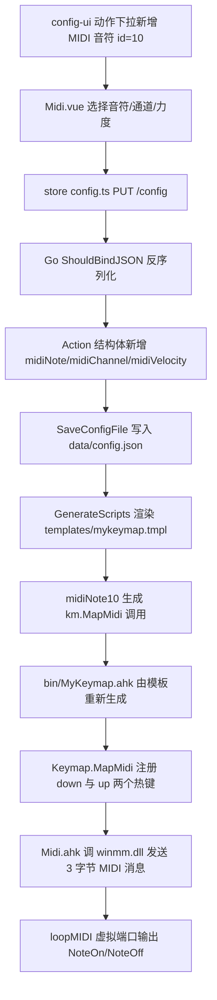

# MyKeymap MIDI 音符映射功能 — 设计方案

**状态：已实现并通过实机验证**

## 1. 目标

在 MyKeymap 图形配置界面中新增一种动作类型 **MIDI 音符**：用户选按键 → 下拉选择「音符号 / MIDI 通道 / 力度」→ 保存后由 AHK 通过 winmm.dll 向 loopMIDI 虚拟端口发送 NoteOn/NoteOff，使 MyKeymap 等同 MIDI 输入设备。

**演奏模型**：按住发声、松开停声（NoteOn 于 keydown，NoteOff 于 keyup）。
**实现方式**：不使用第三方库，AHK 直接 `DllCall` 调 `winmm.dll` 的 `midiOutOpen / midiOutShortMsg / midiOutClose`。

## 2. 总体数据流



## 3. 数据结构设计

### 3.1 动作级字段（每个 MIDI 动作自带）

沿袭项目「平铺宽表」风格，在 `Action` 上新增 3 个字段（Go 与 TS 两端同步）：

| 字段 | 类型 | 说明 | 缺省 |
|---|---|---|---|
| `midiNote` | int | 音符号 0–127（C-1=0 … G9=127） | 无 |
| `midiChannel` | int | MIDI 通道 1–16 | 1 |
| `midiVelocity` | int | 力度 1–127（0 表示 NoteOff，不用于按键） | 100 |

- 采用 `omitempty`（Go）/ 可选属性（TS）。0 值天然代表「未设置」，无歧义。
- 切换动作类型时 [`onActionTypeChange`](config-ui/src/components/actions/Action.vue:53) 会自动清理这些字段，无需额外处理。

### 3.2 全局设置（端口）

MIDI 端口是全局的，放入 `Options`，新增：

```go
type Midi struct {
    Enabled  bool   `json:"enabled"`
    PortName string `json:"portName"` // 例如 "loopMIDI Port"
}
```

- 端口名默认值为 `MykeyMap-Midi`：`PortName` 为空时由后端 [`ParseConfig`](config-server/internal/script/config.go:57) 缺省填入（决策记录，见下）。AHK 侧对该端口名做**精确匹配**；匹配不到即视为不可用，**不自动创建、不回退**，启动时提示用户去 loopMIDI 创建该端口。
- 前端在设置页新增「MIDI」分区：开关 + 端口名输入框。

## 4. 接入点清单（逐文件）

### 4.1 前端 config-ui

| 文件 | 改动 |
|---|---|
| [`config-ui/src/types/config.ts`](config-ui/src/types/config.ts:1) | `Action` 增 `midiNote?/midiChannel?/midiVelocity?`；`Options` 增 `midi`；新增 `Midi` 接口 |
| [`config-ui/src/components/actions/Action.vue`](config-ui/src/components/actions/Action.vue:19) | `actionTypes` 增 `{ id: 10, label: "label:210", hideInAbbr: true }`；`components` 增 `10: Midi`；import Midi |
| `config-ui/src/components/actions/Midi.vue` | 新建：音符号下拉（128 项）、通道下拉（1–16）、力度滑块（1–127）；`watchEffect` 设 `isEmpty` |
| [`config-ui/src/store/language-map.ts`](config-ui/src/store/language-map.ts:111) | 增 210 及字段标签 411/412/413/414、端口设置相关标签 |
| [`config-ui/src/views/Settings.vue`](config-ui/src/views/Settings.vue:1) | 新增 MIDI 设置分区（开关 + 端口名） |

音符号显示名生成：`name(n) = 音名[ n%12 ] 与 八度 floor(n/12)-1`，音名用升号制 `C C# D D# E F F# G G# A A# B`。

### 4.2 后端 config-server (Go)

| 文件 | 改动 |
|---|---|
| [`config-server/internal/script/config.go`](config-server/internal/script/config.go:33) | `Action` 增 3 个字段；**必改，否则前端字段被 ShouldBindJSON 丢弃** |
| [`config-server/internal/script/options.go`](config-server/internal/script/options.go:8) | `Options` 增 `Midi` 字段与 `Midi` 结构体 |
| [`config-server/internal/script/action.go`](config-server/internal/script/action.go:14) | `actionMap` 增 `10: midiNote10`；实现 `midiNote10` |
| [`config-server/templates/mykeymap.tmpl`](config-server/templates/mykeymap.tmpl:5) | 增 `#Include lib/Midi.ahk`；[`InitKeymap()`](config-server/templates/mykeymap.tmpl:30) 内调用 `MidiInit("<portName>")` |

`midiNote10` 生成形态（复用 `GetHotkeyContext` 返回的 `, , winTitle, condType`）：

```go
func midiNote10(a Action, inAbbrContext bool) string {
    if inAbbrContext { return "" } // 前端已 hideInAbbr
    return fmt.Sprintf(`km.MapMidi("%[1]s", %[2]d, %[3]d, %[4]d%[5]s)`,
        a.Hotkey, a.MidiNote, a.MidiChannel, a.MidiVelocity, Cfg.GetHotkeyContext(a))
}
```

生成结果示例：`km.MapMidi("*q", 60, 1, 100)` 或带窗口组 `km.MapMidi("*q", 60, 1, 100, , "ahk_exe code.exe", 1)`。

### 4.3 AHK 运行时 bin/lib

| 文件 | 改动 |
|---|---|
| `bin/lib/Midi.ahk`（新建） | winmm.dll 封装：`MidiInit / MidiNoteOn / MidiNoteOff / MidiAllNotesOff / MidiClose` |
| [`bin/lib/KeymapManager.ahk`](bin/lib/KeymapManager.ahk:253) | `Keymap` 类新增 `MapMidi(...)` |
| [`bin/lib/Functions.ahk`](bin/lib/Functions.ahk:27) | `MyKeymapExit` 内加 `MidiAllNotesOff()` 与 `MidiClose()`，防卡音 |

**MapMidi 设计**（对标 [`RemapInHotIf`](bin/lib/KeymapManager.ahk:457) 的 down/up 成对写法）：

```ahk
MapMidi(hotkeyName, note, channel := 1, velocity := 100, keymapToLock := false, winTitle := "", conditionType := 0) {
  down(thisHotkey) => MidiNoteOn(note, channel, velocity)
  up(thisHotkey)   => MidiNoteOff(note, channel)
  this.Map(hotkeyName, down, keymapToLock, winTitle, conditionType)
  this.Map(hotkeyName . " up", up, false, winTitle, conditionType)
}
```
- 第 5 个参数名与 `Map` 对齐，这样 `GetHotkeyContext` 的空占位能自然落到 `keymapToLock`。
- `singlePress` 无物理松开语义，MIDI 不支持，检测到直接跳过。

**Midi.ahk 关键点**：
- `MIDIOUTCAPS` 结构用 Buffer 承载；`szPname` 位于偏移 8，用 `StrGet(ptr+8, "UTF-16")` 读取。
- 枚举：`midiOutGetNumDevs()` → 逐个 `midiOutGetDevCaps(i, buf, size)` 匹配端口名。
- 发送：`dwMsg = (0x90|(ch-1)) | (note<<8) | (vel<<16)`（NoteOn）、`(0x80|(ch-1)) | (note<<8)`（NoteOff）。
- 句柄缓存为模块级静态变量，进程内只 `midiOutOpen` 一次。

## 5. 关键风险与对策

| 风险 | 对策 |
|---|---|
| AHK v2 无内置 MIDI，winmm 结构体在 64 位下对齐 | 独立小脚本先行验证 `midiOutGetDevCaps` 读端口名正确 |
| 重载/退出时按键未松导致卡音 | `MyKeymapExit` 发 CC123 All Notes Off；`MidiClose` |
| 鼠标滚轮无 up 事件 | 文档标注 MIDI 仅支持键盘键 |
| 后端丢弃未知字段 | Go `Action` 必须声明新字段（本方案已含） |
| 缩写模式语义不符 | 前端 `hideInAbbr: true`，后端 `inAbbrContext` 返回空 |
| `bin/MyKeymap.ahk` 是生成物 | 只改模板与 Go，构建时由 `GenerateScripts` 重生成 |

## 6. 验证方式

1. 装 loopMIDI 并创建虚拟端口。
2. 构建：`cd config-server && go build -o ../bin/settings.exe ./cmd/settings` → 运行生成脚本。
3. 前端 `cd config-ui && npm install && npm run dev`，配置某键为 MIDI 音符（如 C4 / 通道1 / 力度100）。
4. 用 MIDI 监视器（MIDI-OX）绑定 loopMIDI 端口，按住键应看到 NoteOn，松开看到 NoteOff。
5. 退出 MyKeymap 验证无残留发声。

## 7. 实现结果与验证结论

**状态：已实现并通过实机验证。**

- 前端动作类型 `id=10`「🎹 MIDI 音符」上线，可选音符号（C-1~G9）/ 通道（1–16）/ 力度（1–127）；设置页新增 MIDI 分区，端口下拉来自 `GET /midi-ports`。
- 后端 `Action` 三字段、`Options.Midi`、`midiNote10` 生成器、模板 `MidiInit` 均按方案落地。
- AHK 侧 `Midi.ahk` 与 `Keymap.MapMidi` 按方案落地；退出时由 `MyKeymapExit` 发送 All Notes Off 并关闭端口。
- 端到端实机验证：真实收到 `0x90`（NoteOn）与 `0x80`（NoteOff）；退出无卡音；边界验证 6 项通过。

与设计稿的差异说明：

- `Options.Midi` 最终只保留 `PortName`，设计稿中的 `Enabled` 开关未实现。
- `midiNote10` 对 `midiChannel == 0` / `midiVelocity == 0` 额外做了兜底为 1 / 100 的处理。
- 默认端口名决策：`PortName` 为空时后端缺省为 `MykeyMap-Midi`（而非保持为空交给 AHK 自动选择），使用户不填也能得到一个稳定、可预期的默认端口名；设置页以 placeholder + 说明文案提示该默认值。

### 7.1 方案变更（实机验证后）：自动创建 → 精确匹配 + 提示

**背景**：首版实现中，当目标端口不存在时，AHK 侧用 teVirtualMIDI 在本进程内自建同名虚拟端口（发送走 `virtualMIDISendData`），创建失败再回退「含 loopMIDI 的端口 > 0 号设备」。实机验证发现问题：

- teVirtualMIDI 自建的端口**不向系统 winmm 注册**，系统枚举（`midiOutGetNumDevs`）看不到它，DAW / MIDI 监视器**根本枚举不到、无法打开**，数据只能自己发给自己；且失败时静默回退到 0 号设备（`Microsoft GS Wavetable Synth`），会让用户**误以为配置成功**。

**新方案（方案 1）**：去掉「自建端口」与「静默回退」，改为**纯 winmm 精确匹配 + 明确提示**：

- [`Midi.ahk`](bin/lib/Midi.ahk:1) 删除 `MidiEnsurePort`、tevm 模式分支、`virtualMIDICreatePortEx2/virtualMIDISendData/virtualMIDIClosePort` 调用及 `g_MidiMode/g_MidiCreatedPort/g_MidiDll` 等仅 tevm 用的状态。
- [`MidiInit(portName)`](bin/lib/Midi.ahk:60) 仅枚举 winmm 输出设备精确匹配端口名（忽略大小写）：匹配到 → `midiOutOpen` 返回 `true`；匹配不到或打开失败 → 返回 `false` 并写入 `g_MidiLastError`（不回退）。
- `MidiSend` 恢复为仅 `midiOutShortMsg`；对外签名 `MidiNoteOn/MidiNoteOff/MidiAllNotesOff/MidiClose` 不变。
- 新增 [`MidiShowNotReadyTip()`](bin/lib/Midi.ahk:155)，端口不可用时用项目既有 `Tip()` 提示「请在 loopMIDI 中创建该端口并保持其运行」；模板 [`InitKeymap`](config-server/templates/mykeymap.tmpl:31) 判断 `MidiInit` 返回值，失败即调用该提示。
- 设置页与文档同步强调「需安装并保持 loopMIDI 运行，并在其中创建名为 `MykeyMap-Midi` 的端口」。

面向用户与开发者的文档见 [`doc/midi.md`](doc/midi.md:1) 与 [`doc/midi-dev.md`](doc/midi-dev.md:1)。
